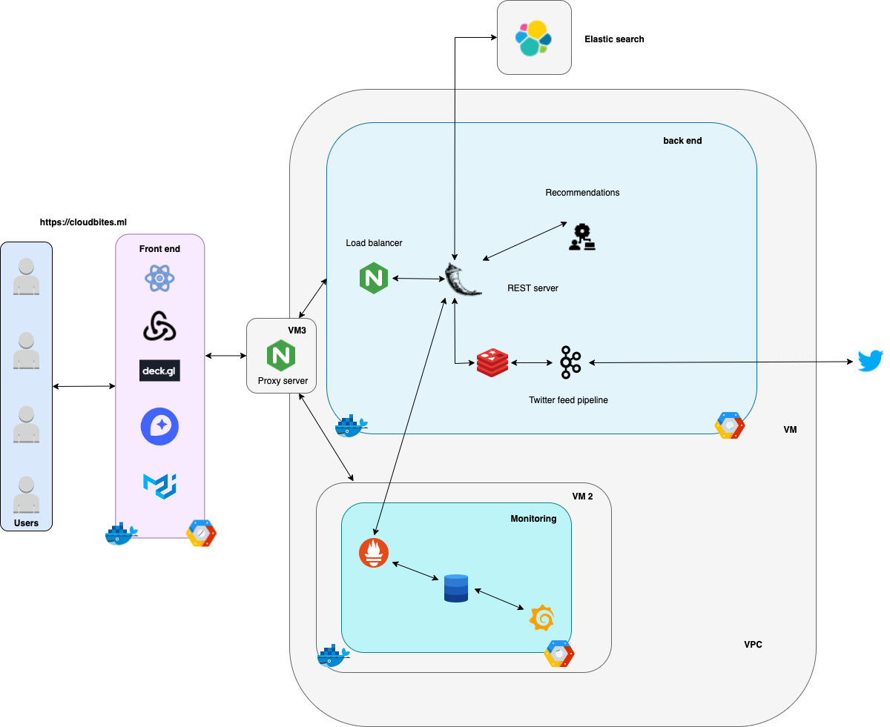

<div align="center">
  <p>
    
  </p>

  <h1 align="center">Cloudbites</h1>
    <br/>

</div>


<!-- TABLE OF CONTENTS -->
<details>
  <summary>Table of Contents</summary>
  <ol>
    <li>
      <a href="#about-the-project">About The Project</a>
      <ul>
        <li><a href="#technologies">Technologies</a></li>
        <li><a href="#architecture">Architecture</a></li>
      </ul>
    </li>
    <li>
      <a href="#getting-started">Getting Started</a>
      <ul>
        <li><a href="#prerequisites">Prerequisites</a></li>
        <li><a href="#installation">Installation</a></li>
      </ul>
    </li>
    <li><a href="#workflow-of-the-system">Workflow of the system</a></li>
    <li><a href="#authors">Authors</a></li>
  </ol>
</details>


<br>

<!-- ABOUT THE PROJECT -->
## About The Project

###### Have you ever been in a dilemma on which restaurant to pick based on the food that you would like to eat?

###### Well look no further - We present to you _Cloudbites!_


Cloudbites is an intuitive and user friendly application that aides with your restaurant selection process by equipping one with multiple processed data points to make a calculated decision.

#### Features

- Massive collection of restaurants from Yelp dataset not restricting one to restaurants signed up with the app.
- Secure account creation, authorization and authentication.
- Searchable restaurant filter based on any relevant text.
- City based search filter.
- Interactive map with processed data to make selections from choices.
- Concise restaurant information like
  - Name
  - Timings
  - Images
  - Reviews
  - Wordcloud of Reviews
  - Unique recommendations
- Twitter feed based on search text


<p align="right">(<a href="#top">back to top</a>)</p>

<!-- Technologies -->
## Technologies


#### Front end
* React
* Redux
* deck.gl
* Mapbox GL
* Material UI

#### Back end
* Elastic search
* Redis
* Kafka
* ZooKeeper
* Flask REST server
* Natural Language Processing
* nginx


#### Deployment and monitoring
* Docker
* GitHub actions
* Prometheus
* Grafana

#### Resources
* GCP Cloud storage(Bucket)
* GCP Virtual machine


<p align="right">(<a href="#top">back to top</a>)</p>


<!-- Architecture -->
## Architecture

<br>

 <p align="center">
    
  </p>

<br>
<p align="right">(<a href="#top">back to top</a>)</p>

<!-- GETTING STARTED -->
## Getting Started

The project follows a microservice architecture. Follow the below steps to setup and run the application locally.

### Prerequisites

The following software, accounts and tools are required to get the project up and running:

* Google cloud account with active credits - To Provision VM and Cloud storage bucket to hold relevant details
* Docker - To run the containers locally
* Elastic search account - To load Yelp data and build meta engine
* Twitter developer account - To access Twitter's searching/streaming api


<p align="right">(<a href="#top">back to top</a>)</p>

### Installation

The application components are split into individual containers. So two docker files are required to be run in order to bring up the application.

1. Either Git clone or download the code from GitHub
2. Navigate to these two folders ``` app/react-ui ``` and ``` app/flask-api``` separately and  run the below commands:

  - ``` docker compose pull ``` - To pull relevant Images
  - ``` docker compose build ``` - To setup dependencies and the containers
  - ``` docker compose up -d ``` - To run the container in detached mode

3. Navigate to ``` localhost:3000  ``` and you should be able to use the application.
4. The backend endpoints are accessible through ``` localhost:5000 ``` - but some are access restricted.
<p align="right">(<a href="#top">back to top</a>)</p>


<!-- Workflow of the system -->
## Future Work

- Type ahead feature in search bar leveraging Meta engine from Elastic search.
- Reverse image search to filter restaurants.
- Setting up websocket to populate relevant filtered tweets.
- Clickable recommended restaurants.
- Additional filters and data points.


<p align="right">(<a href="#top">back to top</a>)</p>

<!-- Authors -->
## Authors

[Vishal Prabhachandar](https://www.linkedin.com/in/vishalprabha/)

[Srinivas Akhil Mallela](https://www.linkedin.com/in/srinivasakhilmallela/)

[Aravind Bisegowda Srinivas](https://www.linkedin.com/in/aravindbs/)

[Soumyadeb Maity](https://www.linkedin.com/in/soumyadeb-maity/)

[Aaron Li](https://www.linkedin.com/in/aaron-li-361a9717b/)


<p align="right">(<a href="#top">back to top</a>)</p>
